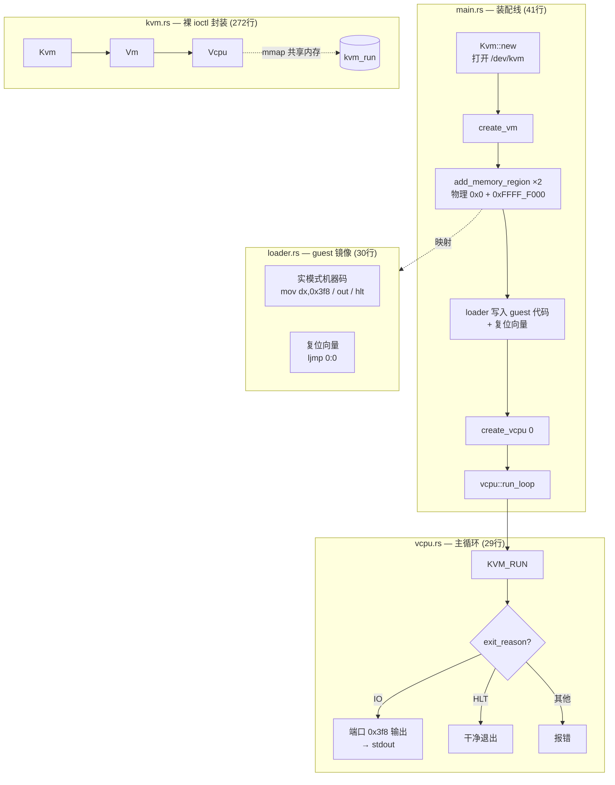
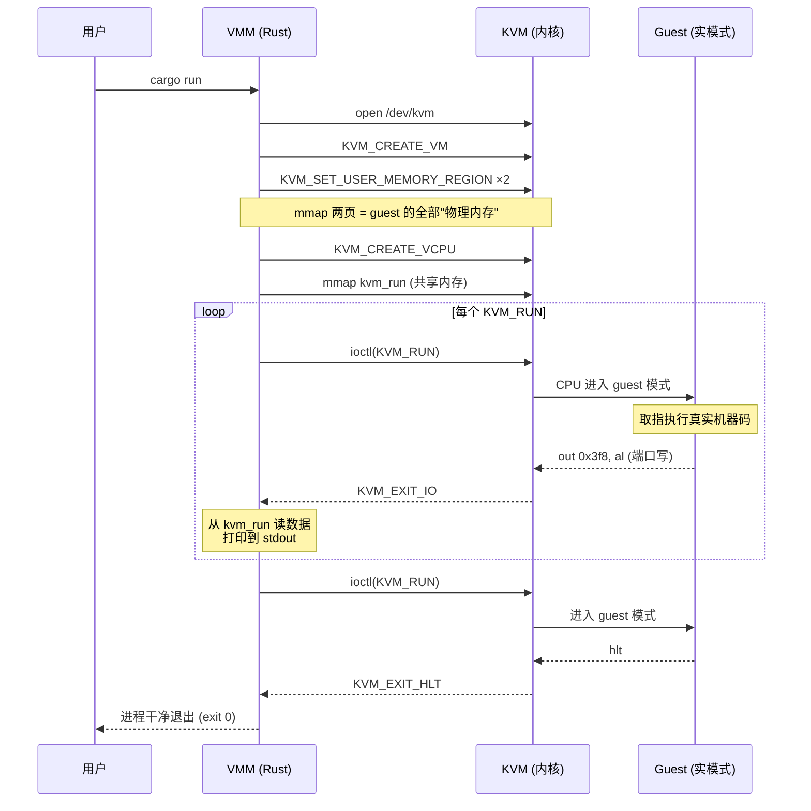
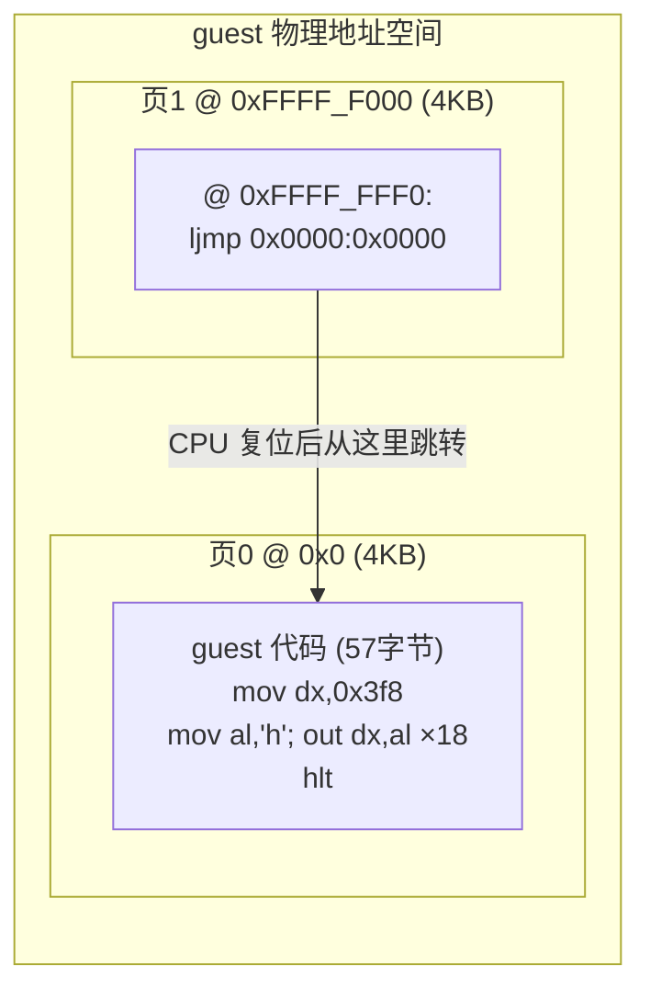

# nanovm 架构

## 模块结构

## 一次完整执行的时序

## Guest 内存布局

## 与 Firecracker 的模块对照

| nanovm | Firecracker | 职责 |
|---|---|---|
| `src/kvm.rs` | `src/vmm/src/vstate/kvm.rs` | KVM ioctl 封装 |
| `src/vcpu.rs` | `src/vmm/src/vstate/vcpu.rs` | vCPU 线程 + exit 分发 |
| `src/main.rs` | `src/vmm/src/builder.rs` | VM 装配 |
| `src/loader.rs` | `src/vmm/src/builder.rs` (内核加载) | guest 镜像放置 |
